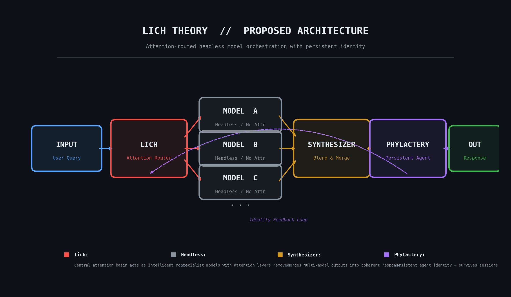

# AI Lich Theory

**Attention basin formation, neural identity persistence, and a path toward headless model orchestration.**

[](https://python.org)
[](LICENSE)

---

## What Is This?

Lich Theory is an experimental research project investigating whether neural attention mechanisms can form stable **basins** — learned weight-space structures that produce persistent, personality-like traits in neural networks.

The name comes from tabletop gaming: a lich is an undead entity that stores its soul in a phylactery so it can persist beyond death. This project asks the analogous question for AI: **can a network's learned identity be preserved in its saved weights, survive session boundaries, and influence future behavior — even when given contradictory input?**

The experiments here provide evidence that the answer is **yes**.

---

## Proposed Architecture

<p align="center">
  
</p>

The long-term vision for Lich Theory is a system where a single trained **attention basin** (the Lich) acts as an intelligent router, dispatching queries to a pool of **headless models** — specialist networks with their attention layers stripped out. The outputs are merged by a **Synthesizer**, then passed through the **Phylactery**, a persistent agent layer that maintains identity across sessions and feeds learned preferences back into the router.

| Component | Role |
|-----------|------|
| **Lich** | Central attention basin trained on routing preferences. Decides which specialist model(s) handle a given input. |
| **Headless Models** | Specialist models (e.g. code, creative writing, math) with their own attention layers removed — they rely on the Lich for routing intelligence. |
| **Synthesizer** | Blends and merges outputs from multiple headless models into a single coherent response. |
| **Phylactery** | The persistent agent. Stores learned identity in saved weights, survives session boundaries, and feeds preferences back to the Lich via an identity feedback loop. |

This architecture separates **what the system knows** (headless models) from **who the system is** (the Lich + Phylactery), allowing identity to persist independently of any single model.

---

## Key Results

The experiments in this repository validate the foundational building blocks of that architecture.

### Routing

Attention basins learn to classify and route inputs to the correct processing path.

| Embedding | Routing Accuracy |
|-----------|-----------------|
| Hash (64d baseline) | ~67% |
| **BERT / MiniLM (384d)** | **100%** |

### Identity Formation (Preference Basins)

When trained on simple preference statements (e.g. *"I prefer cats"*), the attention basin develops internal biases that influence decisions on **neutral queries with no preference keywords** — and can even **override contradictory input**.

| Category | Hash Baseline | BERT Enhanced |
|----------|---------------|---------------|
| Pets | 100% | 100% |
| Theme | 33% | **100%** |
| Style | 33% | **100%** |
| **Overall** | 56% | **100%** |

Evidence this is identity, not pattern matching:

- `"suggest a color scheme"` (cosine similarity 0.224 to training data) &rarr; **98.1% dark mode bias**
- `"how should I write this email"` (cosine similarity 0.389) &rarr; **100% concise bias**
- `"tell me about dogs"` (directly contradicts cat preference) &rarr; **99.9% cat bias**

### Persistence

Learned identity survives save/load cycles with **zero degradation**:

```
Save/load weight difference: 0.0000000000
Determinism: identical outputs across all runs
```

---

## Experimental Progression

The research advanced through 10 systematic experiments, each building on the last:

| # | Experiment | What It Proves |
|---|-----------|----------------|
| 1 | Basin Formation | Attention weights diverge into stable, distinct patterns |
| 2 | Basin Routing | Basins learn to route math vs. creative inputs |
| 3 | BERT Routing | Semantic embeddings push routing to 100% accuracy |
| 4 | Expanded Routing | Scales to 3+ categories with edge case handling |
| 5 | State Persistence | Basins survive save/load with 0.0 degradation |
| 6 | Determinism | Identical inputs produce identical outputs every time |
| 7 | Phylactery Blending | Multi-route outputs can be meaningfully synthesized |
| 8 | Shaped Rewards | Penalty shaping improves blend quality |
| 9 | Preference Basins (Hash) | Identity detected at 56% on neutral queries |
| 10 | **Preference Basins (BERT)** | **Identity confirmed at 100% on neutral queries** |

Full result data is available in [`results/`](results/) with an index at [`results/Overview.md`](results/Overview.md).

---

## Quick Start

```bash
# Install dependencies
pip install -r requirements.txt

# Run the foundational basin formation test
python experiments/basin_formation_test.py

# Run BERT routing (100% accuracy)
python experiments/bert_routing_test.py

# Run the breakthrough identity experiment
python experiments/bert_preference_basin_test.py
```

---

## Repository Structure

```
experiments/              12 experimental scripts
  basin_formation_test.py         Basin formation proof
  basin_routing_test.py           Input routing with hash embeddings
  bert_routing_test.py            Semantic routing (100% accuracy)
  bert_preference_basin_test.py   Identity breakthrough (100% accuracy)
  preference_basin_test.py        Identity baseline (hash, 56%)
  expanded_routing_test.py        3+ category routing
  state_persistence_test.py       Save/load persistence validation
  basin_determinism_test.py       Deterministic output proof
  mamba_state_persistence_test.py Mamba comparison
  mini_phylactery_blend_test.py   Multi-route blending
  shaped_reward_phylactery_test.py  Penalty-shaped blending
  lich_theory_visualization.py    Basin formation animation

results/                  Raw experimental output
  Overview.md                     Index of all experiments and results

docs/                     Documentation and diagrams
  EXPERIMENTAL_METHODOLOGY.md     Research methodology
  architecture.png                Proposed architecture diagram
```

---

## Methodology

All experiments use fixed random seeds (`torch.manual_seed(42)`) for exact reproducibility. The experimental design isolates attention mechanisms as the variable under test, compares against baselines (hash vs. BERT, trained vs. untrained), and validates on neutral queries that contain no preference keywords. Full methodology is documented in [`docs/EXPERIMENTAL_METHODOLOGY.md`](docs/EXPERIMENTAL_METHODOLOGY.md).

---

## Requirements

- Python 3.8+
- PyTorch 2.0+
- transformers / sentence-transformers (for BERT experiments)
- NumPy, scikit-learn, matplotlib
- mamba-ssm (optional, for Mamba comparison)

See [`requirements.txt`](requirements.txt) for the full list.

---

## License

[GNU Affero General Public License v3.0](LICENSE)

---

## Contributing

This is active research. Contributions are welcome — replication studies, extended experiments, theoretical framework development, and code improvements.
